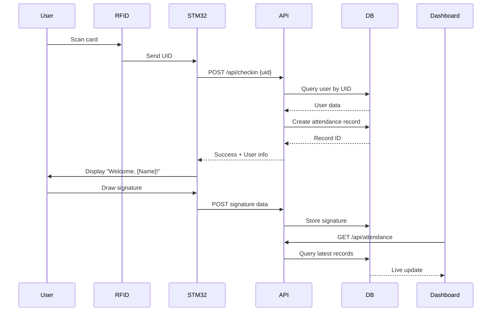
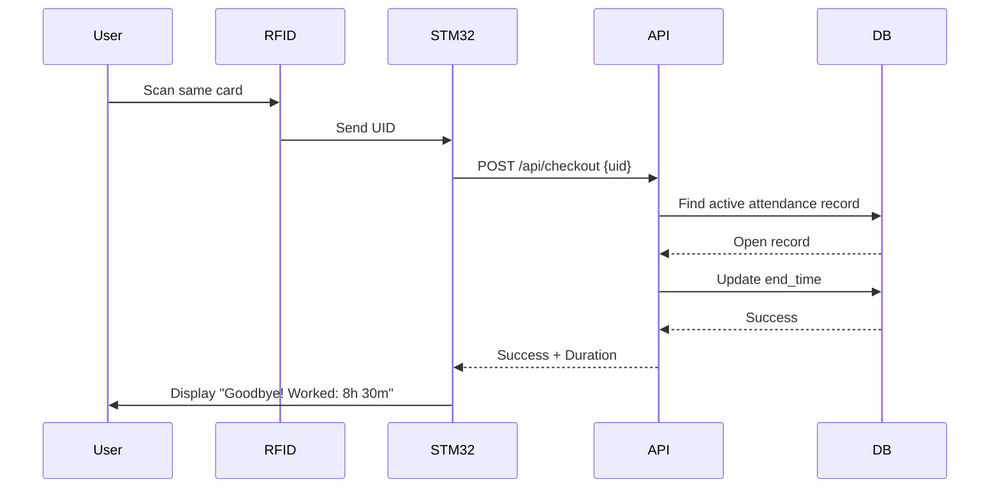
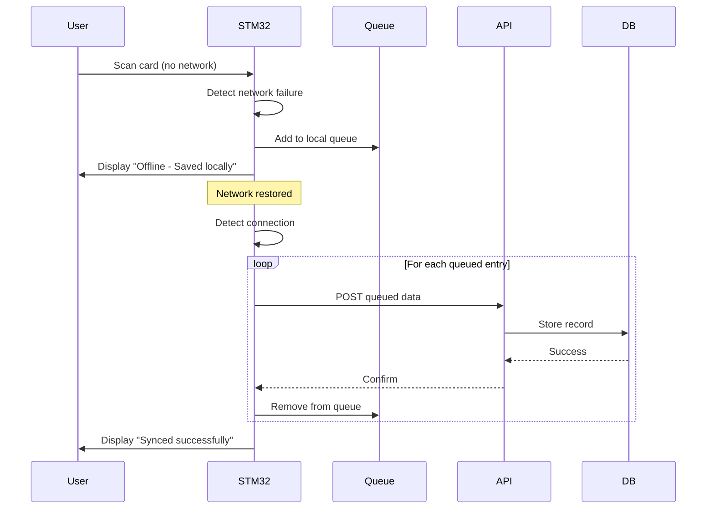

# System Architecture

> Detailed overview of the attendance tracking system architecture, data flow, and component interactions.

---

## Table of Contents

- [Overview](#overview)
- [System Components](#system-components)
- [Data Flow](#data-flow)
- [Communication Protocol](#communication-protocol)
- [Technology Stack](#technology-stack)

---

## Overview

The attendance system follows a **client-server architecture** with an embedded hardware client (STM32) communicating with a centralized backend server. The system is designed for reliability, with offline capabilities and automatic synchronization.

### Design Principles

- **Reliability**: Offline mode ensures no data loss during network outages
- **Simplicity**: Single RFID card for both check-in and check-out
- **Security**: Signatures provide legal verification of attendance
- **Scalability**: Backend designed to handle multiple devices
- **Real-time**: Immediate feedback to users and live dashboard updates

---

## System Components

### 1. Hardware Device (STM32)

**Purpose**: Physical attendance terminal for user interaction

**Components**:
- **STM32F7 Microcontroller**: Main processing unit (A7 + M4 cores)
- **RFID Reader**: RC522 module for card scanning
- **Touchscreen Display**: Capacitive touch for signature input
- **Network Module**: WiFi connectivity for server communication

**Responsibilities**:
- Read RFID card UIDs
- Display user interface (ImGui)
- Capture touch signatures
- Send attendance data to API
- Queue entries during offline mode
- Provide user feedback (visual/audio)

**Technology**: C++, Embedded Linux, ImGui

[→ Hardware Details](HARDWARE.md)

---

### 2. Backend API

**Purpose**: Central data processing and business logic

**Endpoints**:
- `/api/checkin` - Process clock-in requests
- `/api/checkout` - Process clock-out requests
- `/api/users` - User management
- `/api/attendance` - Retrieve attendance records
- `/api/signatures` - Signature data retrieval

**Responsibilities**:
- Validate RFID and user data
- Calculate attendance duration
- Store signatures as binary data
- Manage database transactions
- Serve dashboard requests

**Technology**: Python Flask, REST API

[→ API Reference](API.md) | [→ Backend Setup](BACKEND.md)

---

### 3. Database

**Purpose**: Persistent storage for all system data

**Schema**:
- `users` - Employee information and RFID mappings
- `attendance` - Clock-in/out records with timestamps
- `signatures` - Binary signature data linked to attendance
- `system_logs` - Audit trail and error logging

**Technology**: PostgreSQL 13+

[→ Database Schema Details](DATABASE_SCHEMA.md)

---

### 4. Admin Dashboard

**Purpose**: Web interface for monitoring and management

**Features**:
- Real-time attendance overview
- Date range filtering
- PDF export with signatures
- User management
- System statistics

**Technology**: HTML5, CSS3, JavaScript (Vanilla)

[→ Dashboard Guide](DASHBOARD.md)

---

## Data Flow

### Clock-In Process



[→ Detailed Clock-In Flow](flows/CLOCKIN_FLOW.md)

---

### Clock-Out Process



[→ Detailed Clock-Out Flow](flows/CLOCKOUT_FLOW.md)

---

### Offline Mode Flow



[→ Offline Mode Details](flows/OFFLINE_MODE.md)

---

## Communication Protocol

### API Request Format

**Clock-In Request**:
```json
{
  "rfid_uid": "A1:B2:C3:D4",
  "timestamp": "2024-11-12T14:30:00Z",
  "device_id": "STM32_001"
}
```

**Clock-In Response**:
```json
{
  "status": "success",
  "user": {
    "id": 42,
    "name": "John Doe",
    "employee_id": "EMP123"
  },
  "attendance_id": 1001,
  "message": "Clocked in successfully"
}
```

**Signature Upload**:
```json
{
  "attendance_id": 1001,
  "signature_data": "base64_encoded_image_data",
  "format": "png"
}
```

[→ Complete API Documentation](API.md)

---

### Network Communication

- **Protocol**: HTTPS (SSL/TLS encrypted)
- **Format**: JSON
- **Authentication**: API key in header (future implementation)
- **Timeout**: 10 seconds
- **Retry Logic**: 3 attempts with exponential backoff

---

## Technology Stack

### Hardware Layer
| Component | Technology | Purpose |
|-----------|-----------|---------|
| Microcontroller | STM32F7 | Main processing |
| OS | Embedded Linux | Device drivers & networking |
| GUI Framework | ImGui (C++) | User interface |
| RFID Module | RC522 | Card reading |
| Display | Capacitive Touch | User input |

### Backend Layer
| Component | Technology | Purpose |
|-----------|-----------|---------|
| API Framework | Flask (Python) | REST endpoints |
| Database | PostgreSQL | Data persistence |
| Containerization | Docker | Deployment |
| Web Server | Gunicorn/Nginx | Production serving |

### Frontend Layer
| Component | Technology | Purpose |
|-----------|-----------|---------|
| HTML/CSS/JS | Vanilla | Dashboard UI |
| Charts | Chart.js | Visualizations |
| PDF Generation | jsPDF | Export functionality |

---

## System Requirements

### Hardware Device
- **Processor**: ARM Cortex-A7 + M4
- **RAM**: 256MB minimum
- **Storage**: 512MB for OS + queue
- **Network**: WiFi 802.11 b/g/n
- **Display**: 800x480 touchscreen

### Backend Server
- **CPU**: 2 cores minimum
- **RAM**: 4GB minimum
- **Storage**: 20GB for database
- **Network**: 1Gbps recommended
- **OS**: Linux (Ubuntu 20.04+)

---

## Security Considerations

### Current Implementation
- Database credentials in environment variables
- Local network deployment only

### Planned Enhancements
- ☐ API authentication tokens
- ☐ SSL certificate for HTTPS
- ☐ RFID UID encryption
- ☐ Rate limiting on API
- ☐ Signature data encryption at rest

[→ Security Implementation Details](SECURITY.md)

---

## Scalability

The system is designed to scale horizontally:

- **Multiple Devices**: Each device operates independently
- **Database**: PostgreSQL can handle 100+ concurrent devices
- **API**: Stateless design allows load balancing
- **Dashboard**: Read-only queries don't impact write performance

**Current Capacity**: 1-10 devices  
**Target Capacity**: 50+ devices with load balancer

---

## Related Documentation

- [Hardware Setup](HARDWARE.md) - Physical device configuration
- [Backend Setup](BACKEND.md) - Server installation
- [API Reference](API.md) - Endpoint specifications
- [Database Schema](DATABASE_SCHEMA.md) - Table structures
- [Troubleshooting](TROUBLESHOOTING.md) - Common issues

---

**Last Updated**: November 2024