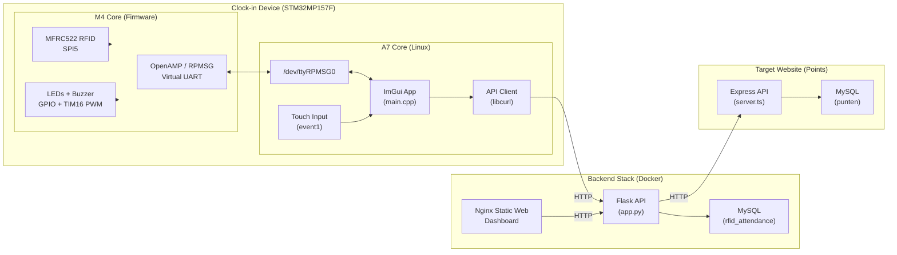

# Component / Deployment Overview

```mermaid
flowchart LR
  subgraph Device["Clock-in Device (STM32MP157F)"]
    subgraph M4["M4 Core (Firmware)"]
      RFID["MFRC522 RFID\nSPI5"]
      GPIO["LEDs + Buzzer\nGPIO + TIM16 PWM"]
      VUART["OpenAMP / RPMSG\nVirtual UART"]
    end
    subgraph A7["A7 Core (Linux)"]
      GUI["ImGui App\n(main.cpp)"]
      TOUCH["Touch Input\n(event1)"]
      APIClient["API Client\n(libcurl)"]
      RPMSG["/dev/ttyRPMSG0"]
    end
    RFID --> M4
    GPIO --> M4
    VUART <--> RPMSG
    RPMSG <--> GUI
    TOUCH --> GUI
    GUI --> APIClient
  end

  subgraph Backend["Backend Stack (Docker)"]
    API["Flask API\n(app.py)"]
    DB["MySQL\n(rfid_attendance)"]
    WEB["Nginx Static Web\nDashboard"]
  end

  subgraph TargetSite["Target Website (Points)"]
    TargetAPI["Express API\n(server.ts)"]
    TargetDB["MySQL\n(punten)"]
  end

  APIClient -->|HTTP| API
  WEB -->|HTTP| API
  API --> DB
  API -->|HTTP| TargetAPI
  TargetAPI --> TargetDB
```
