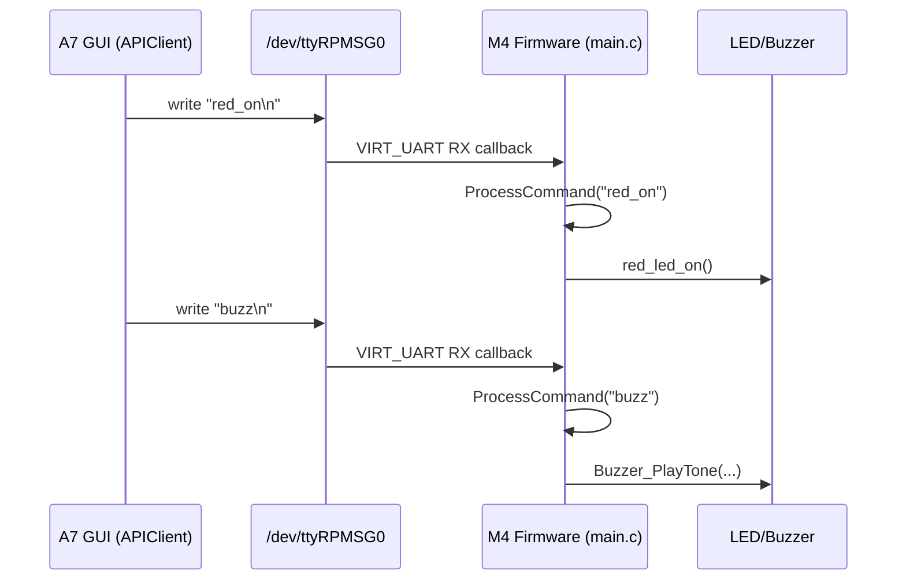

# M4 Firmware Command Flow (Control Channel)

```mermaid
sequenceDiagram
  participant A7 as A7 GUI (APIClient)
  participant RP as /dev/ttyRPMSG0
  participant M4 as M4 Firmware (main.c)
  participant HW as LED/Buzzer

  A7->>RP: write "red_on\n"
  RP->>M4: VIRT_UART RX callback
  M4->>M4: ProcessCommand("red_on")
  M4->>HW: red_led_on()

  A7->>RP: write "buzz\n"
  RP->>M4: VIRT_UART RX callback
  M4->>M4: ProcessCommand("buzz")
  M4->>HW: Buzzer_PlayTone(...)
```
