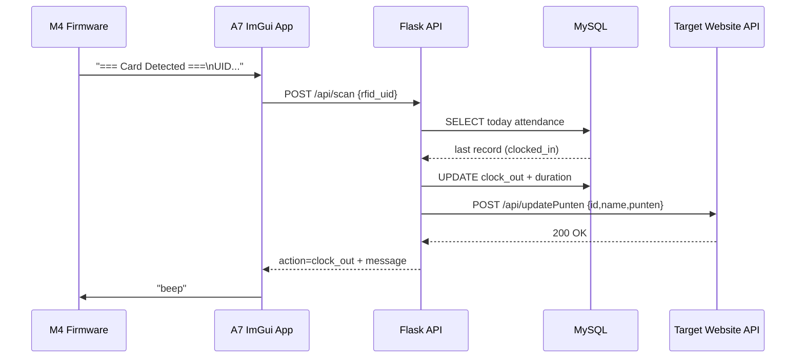

# Clock-Out With Points Update

```mermaid
sequenceDiagram
  participant M4 as M4 Firmware
  participant A7 as A7 ImGui App
  participant API as Flask API
  participant DB as MySQL
  participant Target as Target Website API

  M4->>A7: "=== Card Detected ===\nUID..."
  A7->>API: POST /api/scan {rfid_uid}
  API->>DB: SELECT today attendance
  DB-->>API: last record (clocked_in)
  API->>DB: UPDATE clock_out + duration
  API->>Target: POST /api/updatePunten {id,name,punten}
  Target-->>API: 200 OK
  API-->>A7: action=clock_out + message
  A7->>M4: "beep"
```
