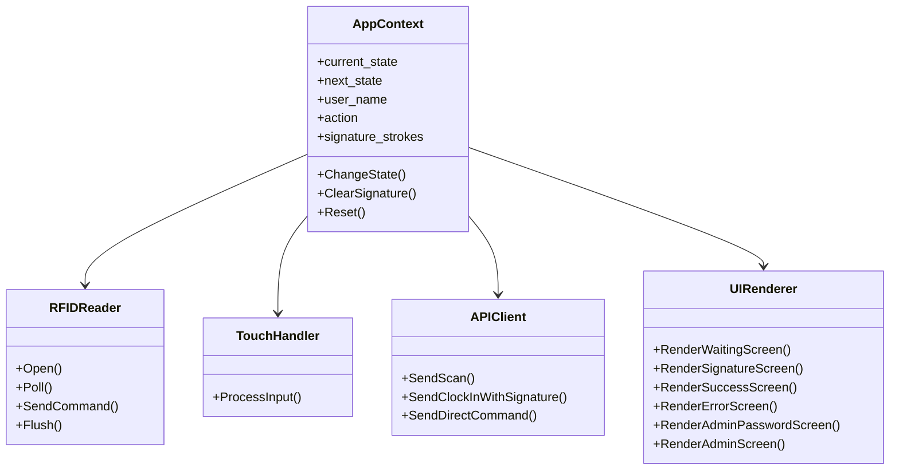

# ImGui Module Class Diagram

```mermaid
classDiagram
  class AppContext {
    +current_state
    +next_state
    +user_name
    +action
    +signature_strokes
    +ChangeState()
    +ClearSignature()
    +Reset()
  }

  class RFIDReader {
    +Open()
    +Poll()
    +SendCommand()
    +Flush()
  }

  class TouchHandler {
    +ProcessInput()
  }

  class APIClient {
    +SendScan()
    +SendClockInWithSignature()
    +SendDirectCommand()
  }

  class UIRenderer {
    +RenderWaitingScreen()
    +RenderSignatureScreen()
    +RenderSuccessScreen()
    +RenderErrorScreen()
    +RenderAdminPasswordScreen()
    +RenderAdminScreen()
  }

  AppContext --> RFIDReader
  AppContext --> TouchHandler
  AppContext --> APIClient
  AppContext --> UIRenderer
```
