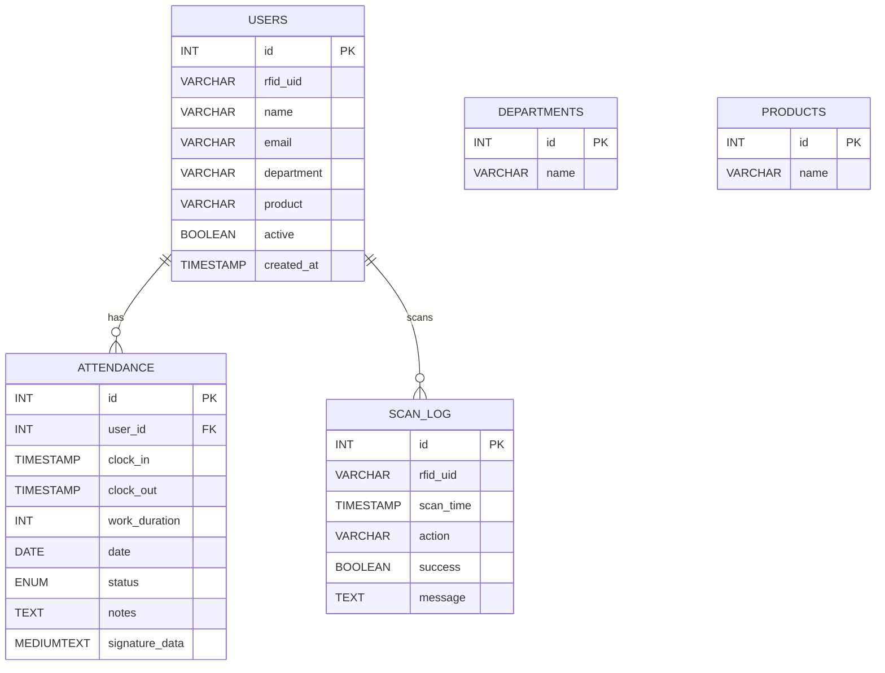

# Database ER Diagram (MySQL)

```mermaid
erDiagram
  USERS {
    INT id PK
    VARCHAR rfid_uid
    VARCHAR name
    VARCHAR email
    VARCHAR department
    VARCHAR product
    BOOLEAN active
    TIMESTAMP created_at
  }

  ATTENDANCE {
    INT id PK
    INT user_id FK
    TIMESTAMP clock_in
    TIMESTAMP clock_out
    INT work_duration
    DATE date
    ENUM status
    TEXT notes
    MEDIUMTEXT signature_data
  }

  SCAN_LOG {
    INT id PK
    VARCHAR rfid_uid
    TIMESTAMP scan_time
    VARCHAR action
    BOOLEAN success
    TEXT message
  }

  DEPARTMENTS {
    INT id PK
    VARCHAR name
  }

  PRODUCTS {
    INT id PK
    VARCHAR name
  }

  USERS ||--o{ ATTENDANCE : has
  USERS ||--o{ SCAN_LOG : scans
```
