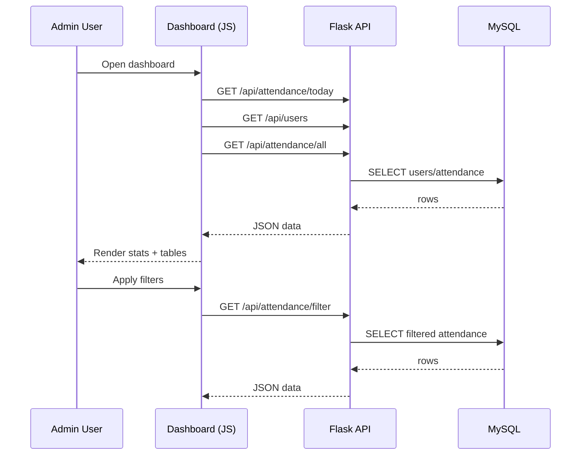

# Web Dashboard Data Flow

```mermaid
sequenceDiagram
  participant Admin as Admin User
  participant Web as Dashboard (JS)
  participant API as Flask API
  participant DB as MySQL

  Admin->>Web: Open dashboard
  Web->>API: GET /api/attendance/today
  Web->>API: GET /api/users
  Web->>API: GET /api/attendance/all
  API->>DB: SELECT users/attendance
  DB-->>API: rows
  API-->>Web: JSON data
  Web-->>Admin: Render stats + tables

  Admin->>Web: Apply filters
  Web->>API: GET /api/attendance/filter
  API->>DB: SELECT filtered attendance
  DB-->>API: rows
  API-->>Web: JSON data
```
